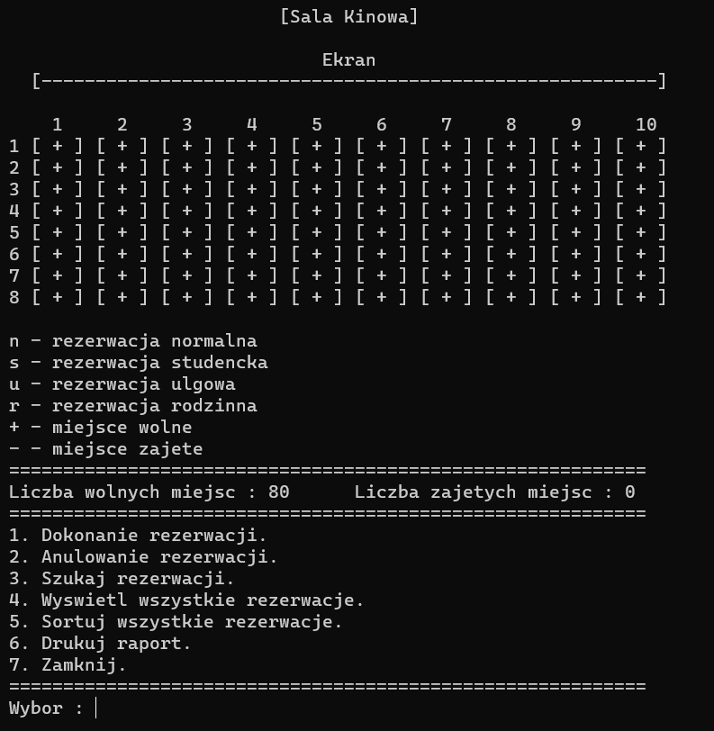
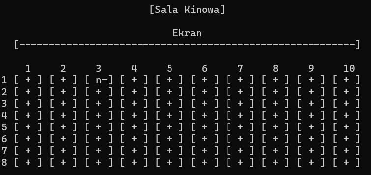
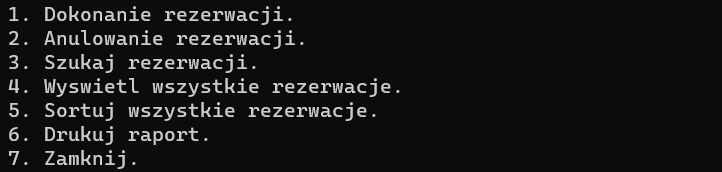
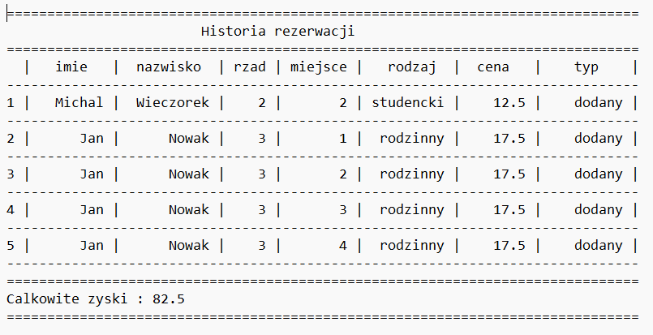

# Cinema Service

It is console program which simulate tictets reservation service in the cinema. The program was written in C++ as a semestral project from the subject Computer Programing during the third semestr of my studies (September 2022/march 2023). In the project I used advance OOP techniques. Program menu is written in polish language. 


## 🚀 About Me
I'm a student of Silesian Univeristy of Sciencie in Poland. I am studing Computer Sciencie and currently looking for first employment/apprenticeship. 


## Program Description

- Main menu:



Program ensure posibility of making reservation with few  options:
- Normal
- Student
- With discount 
- Family (choosing this option user need to reserve 4 sits)

During the reservation process user is asked about kind of reservation and also position in the cinema room. When the reservation succed reserved sit will be displayed on the cinema animation in main menu.



Program also contain option to search data base of the reservation. You can display records in several ways:
- sort by count of reservation on specific name
- display only normal reservations 
- display only student reservations
- display only discount reservations
- display only family reservations
Additionally, you can also search reservation by the specitic name using option "Szukaj rezerwacji" or display all records by option "Wyswietl wszystkie rezerwacje". There is also an option to cancel reservation - "Anulowanie rezerwacji".



In main menu program calculate current profits and statistics which can be saved in outer txt file when user use option "Drukuj raport".


## Run Locally

Clone the project

```bash
  https://github.com/mw301883/MyProjects.git
```

Go to the Release file

```bash
  run executable file ProjektPK3.exe
```


## Tech Stack

**Languages:** C++          
 


