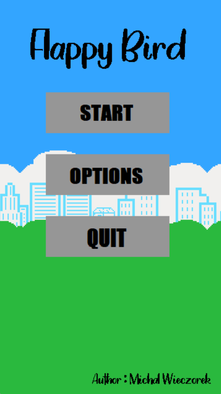
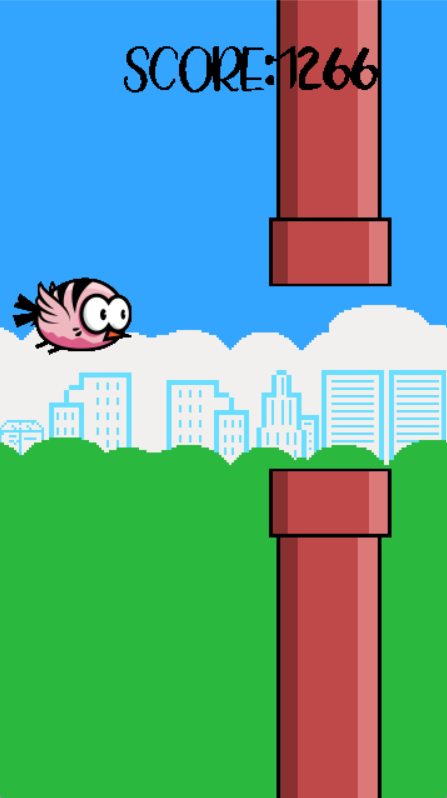

# Flappy Bird

It is my version of very well common know game wrote in C++ from scratch. I've used SDL2 graphic library in version 2.0.22.


## 🚀 About Me
I'm a student at Silesian Univeristy of Technology in Poland. I am studing Computer Science and currently looking for first employment/apprenticeship. 


## Game Description

Game rules are very simple, you control The Bird and by pressing SPACE. The Bird is able to move only up and down in order to avoid the Pipes. In case of the contact with the obstacles the game is over. The speed of the game is constantly changing, as long as you play the speed will be increasing. Try yourself and get some Score!!!


## Game Settings

- Light/dark mode toggle
- On/Off sounds


## Screenshots

&nbsp;&nbsp;&nbsp;&nbsp;&nbsp;&nbsp;&nbsp;&nbsp;&nbsp;&nbsp;&nbsp;&nbsp;&nbsp;&nbsp;&nbsp;&nbsp;&nbsp;&nbsp;&nbsp;&nbsp;&nbsp;&nbsp;


## Run Locally

Clone the project

```bash
  https://github.com/mw301883/MyProjects.git
```

Go to the Release file

```bash
  run executable file FlappyBirdSDL.exe
```


## Tech Stack

**Languages:** C++          
**Libraries:** SDL2-2.0.22, SDL2_image-2.0.5, SDL2_ttf-2.0.18,SDL2_mixer-2.0.4  


