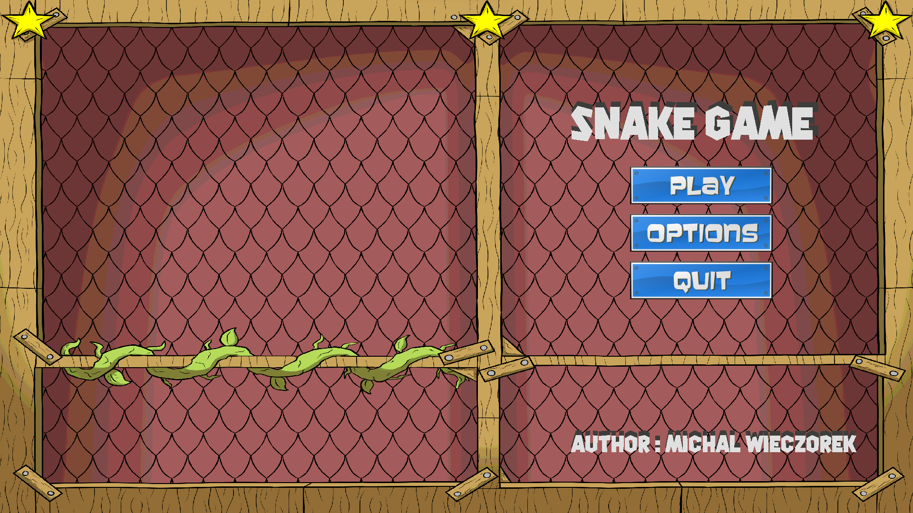
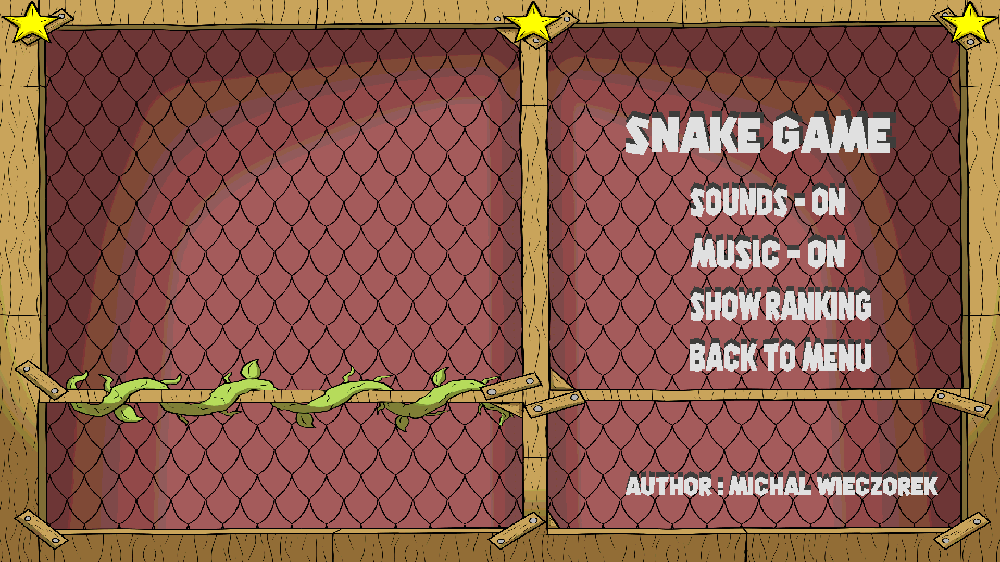
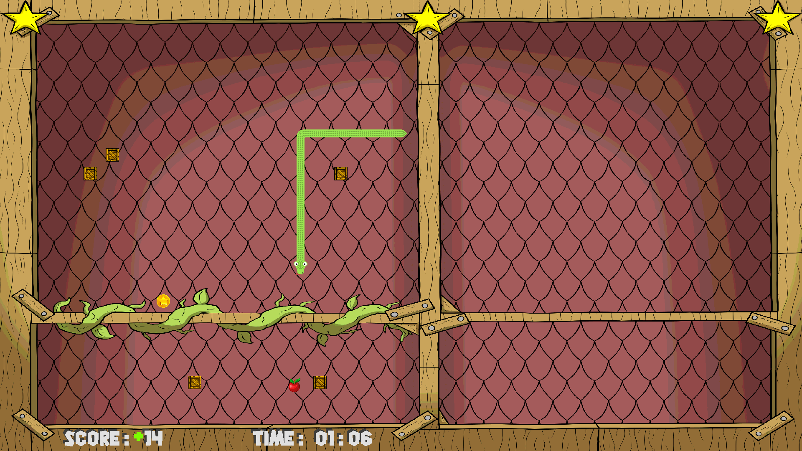
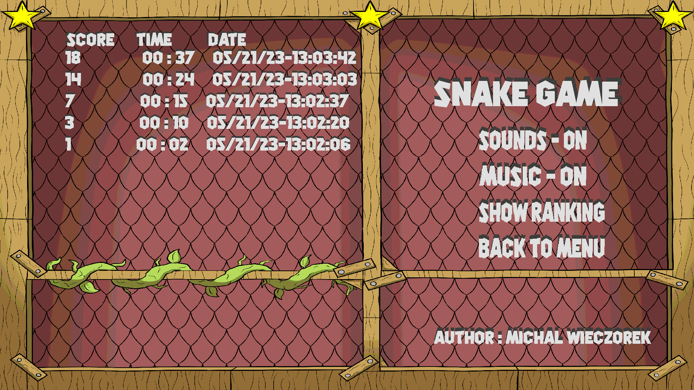

# Snake Game

 This is my own version of popular game Snake with few modifications. Program is being written in C++ with extended graphic library SDL2 as well as my other project FlappyBird. Project will be my semestral graduate program of the subject Comuper Programing 4 (the fourth semester). Below I put some screenshots to demonstrate the game. If you want to try this game on your machine you can easliy run it by clicking the executable file in Release folder, however make sure that your screen setting are set corectly becasue the program have only full screen mode.    


## 🚀 About Me
Hi, my name is Michał  Wieczorek I'm a student of Silesian Univeristy of Sciencie in Poland. I am studing Computer Sciencie and currently looking for first employment/apprenticeship.


## Game Settings

- ON/OFF sounds
- ON/OFF music
- Displaying the record table - if somebody breaks a record, this table will be automatically updated. It shows the score, time in the game, and the date.


## Screenshots

&nbsp;&nbsp;&nbsp;&nbsp;&nbsp;&nbsp;&nbsp;&nbsp;&nbsp;&nbsp;&nbsp;&nbsp;&nbsp;&nbsp;&nbsp;&nbsp;&nbsp;&nbsp;&nbsp;&nbsp;&nbsp;&nbsp;
&nbsp;&nbsp;&nbsp;&nbsp;&nbsp;&nbsp;&nbsp;&nbsp;&nbsp;&nbsp;&nbsp;&nbsp;&nbsp;&nbsp;&nbsp;&nbsp;&nbsp;&nbsp;&nbsp;&nbsp;&nbsp;&nbsp;
&nbsp;&nbsp;&nbsp;&nbsp;&nbsp;&nbsp;&nbsp;&nbsp;&nbsp;&nbsp;&nbsp;&nbsp;&nbsp;&nbsp;&nbsp;&nbsp;&nbsp;&nbsp;&nbsp;&nbsp;&nbsp;&nbsp;
## Run Locally

Clone the project

```bash
  https://github.com/mw301883/MyProjects.git
```

Go to the Release file

```bash
  run executable file Snake_Game.exe
```


## Tech Stack

**Languages:** C++

**Libraries:** SDL2-2.0.22, SDL2_image-2.0.5, SDL2_ttf-2.0.18,SDL2_mixer-2.0.4          
 


