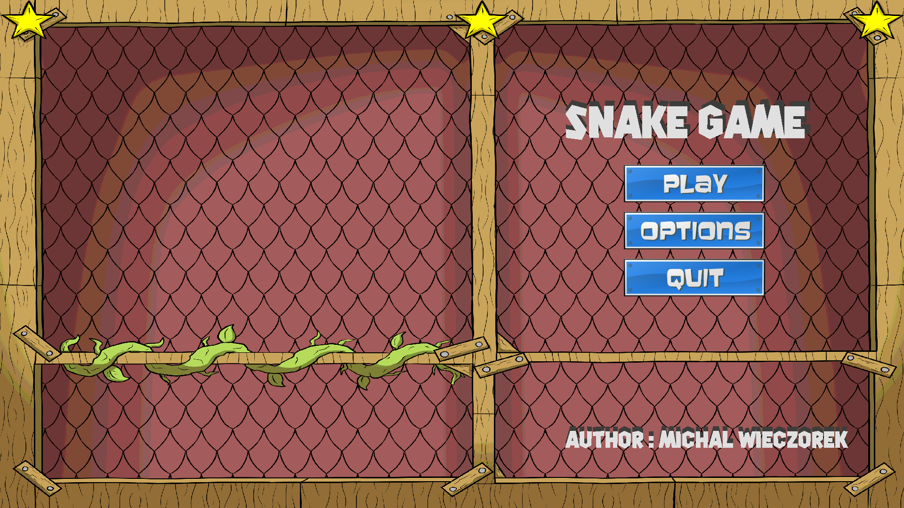
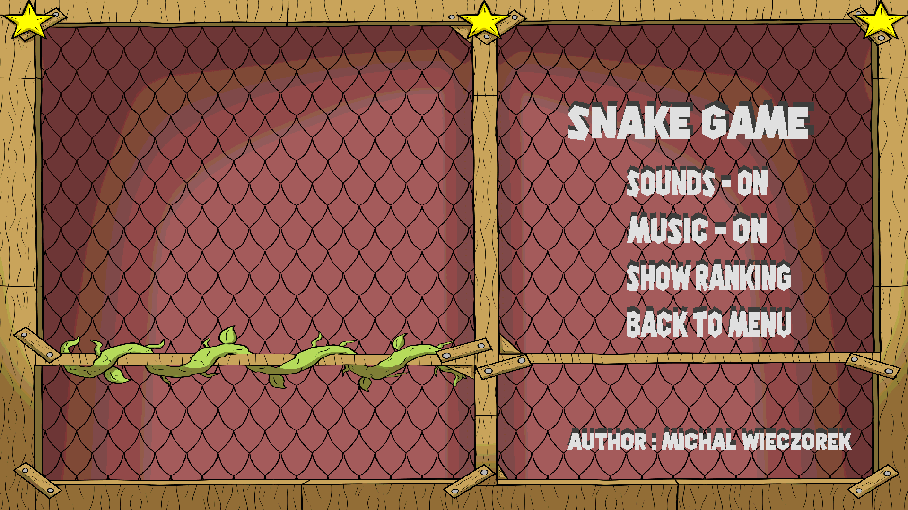
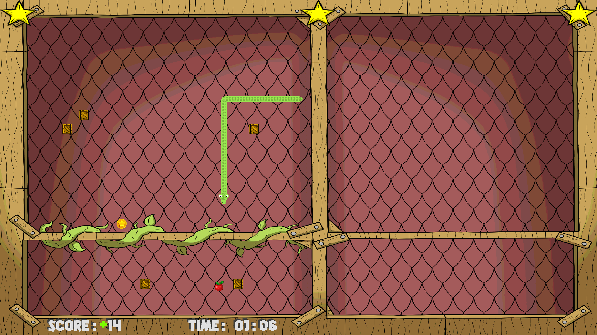

# Snake Game

 This is the alpha version of my newest game Snake with a few modifications. The program is being written in C++ with the extended graphics library SDL2, as well as my other project, Flappy Bird. This project will be my semester-long graduate program for the subject Computer Programming 4 (the fourth semester). Below, I have included some screenshots to demonstrate the game. If you want to try this game on your machine, you can easily run it by clicking the executable file in the Release folder. However, make sure that your screen settings are correctly set because the program only has a full-screen mode.


## Screenshots

&nbsp;&nbsp;&nbsp;&nbsp;&nbsp;&nbsp;&nbsp;&nbsp;&nbsp;&nbsp;&nbsp;&nbsp;&nbsp;&nbsp;&nbsp;&nbsp;&nbsp;&nbsp;&nbsp;&nbsp;&nbsp;&nbsp;
&nbsp;&nbsp;&nbsp;&nbsp;&nbsp;&nbsp;&nbsp;&nbsp;&nbsp;&nbsp;&nbsp;&nbsp;&nbsp;&nbsp;&nbsp;&nbsp;&nbsp;&nbsp;&nbsp;&nbsp;&nbsp;&nbsp;

## Run Locally

Clone the project

```bash
  https://github.com/mw301883/MyProjects.git
```

Go to the Release file

```bash
  run executable file Snake_Game.exe
```


## 🚀 About Me
Hi, my name is Michał  Wieczorek I'm a student of Silesian Univeristy of Sciencie in Poland. I am studing Computer Sciencie and currently looking for first employment/apprenticeship.

